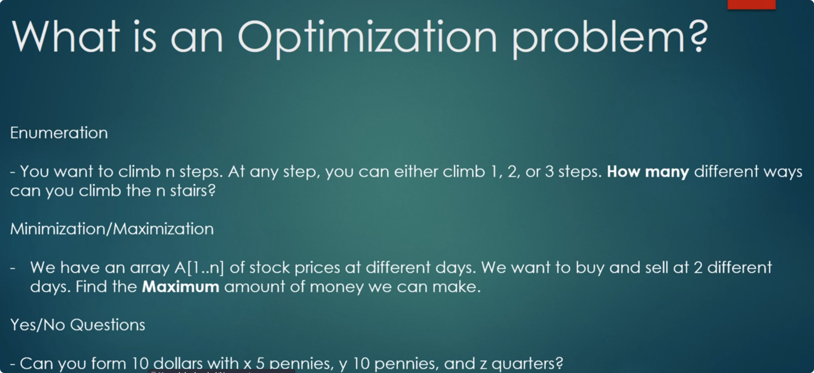
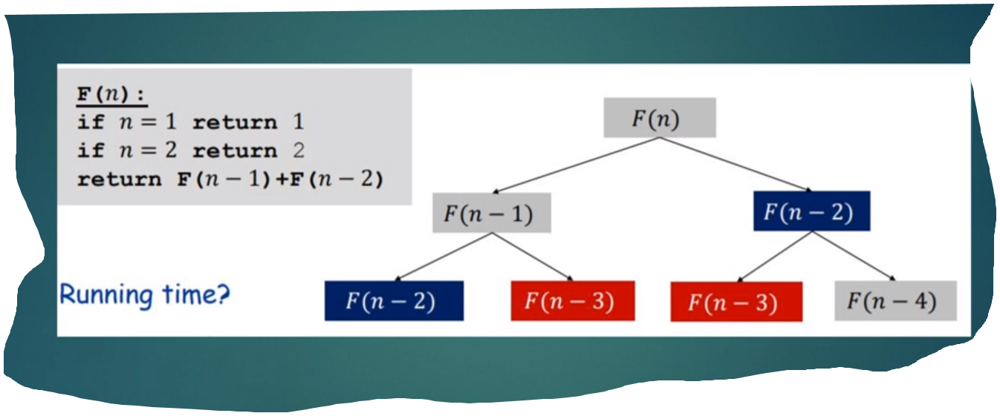
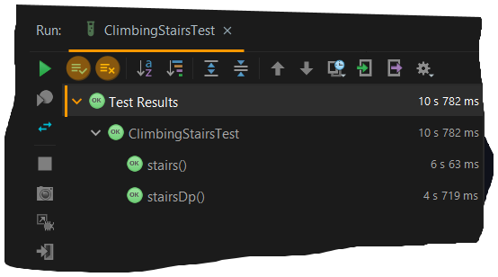

## Dynamic Programming

## Advantages:
1. Avoiding repetition of same step

2. Improve performance due to step1

 |S.No| Problem | Difficulty | Solved | NeedRevision?  | Comments/Algorithms/Tags  |
 |---|---|---|---|---|---|
  | 1 |  | | | | |
  | 2| | | | | |
  | 3 | | | | | |
  | 4 | | | | | |
  | 5 | | | | | |
  | 6 | | | | | |
  | 7 | | | | | |
  | 8 | | | | | |
  | 9 | | | | | |
  | 10 | | | | | |
  | 11 | | | | | |
  | 12 | | | | | |
  | 13 | | | | | |
  | 14 | | | | | |
  | 15 | | | | | |
