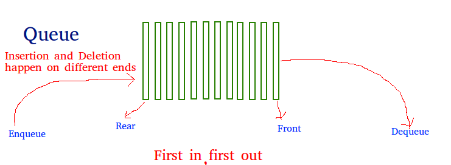

## Queue

###Intro:

*Operations on Queue:* Mainly the following four basic operations are performed on queue:
1. Enqueue: Adds an item to the queue. If the queue is full, then it is said to be an Overflow condition.
2. Dequeue: Removes an item from the queue. The items are popped in the same order in which they are pushed. If the queue is empty, then it is said to be an Underflow condition.
3. Front: Get the front item from queue.
4. Rear: Get the last item from queue.

 |S.No| Problem | Difficulty | Solved | Rethink?  | Comments/Algorithms/Tags  |
 |---|---|---|---|---|---|
  | 1 | Queue Using Circular Array Concept for O(1) on Dequeue | Basic |  Yes | No | Better than queue with normal array that takes O(n) for dequeue [Swaps]|
  | 2| | | | | |
  | 3 | | | | | |
  | 4 | | | | | |
  | 5 | | | | | |
  | 6 | | | | | |
  | 7 | | | | | |
  | 8 | | | | | |
  | 9 | | | | | |
  | 10 | | | | | |
  | 11 | | | | | |
  | 12 | | | | | |
  | 13 | | | | | |
  | 14 | | | | | |
  | 15 | | | | | |