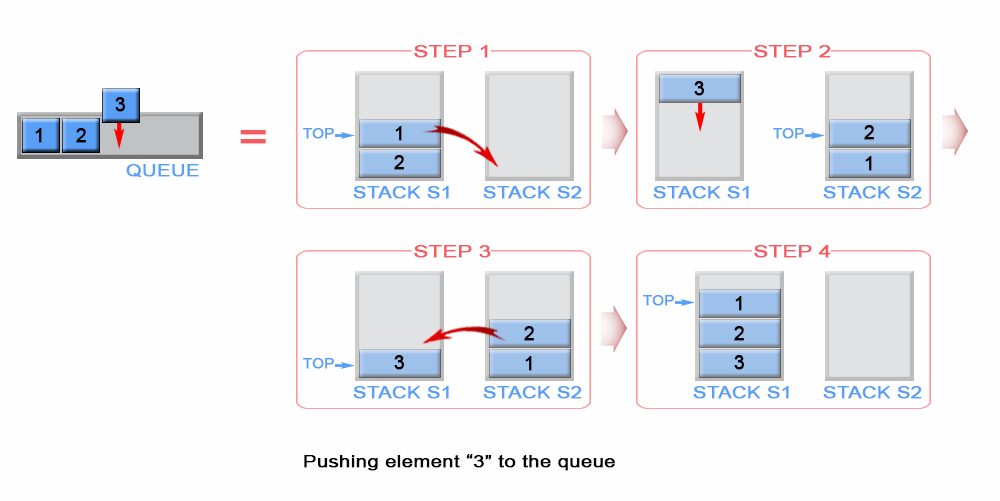
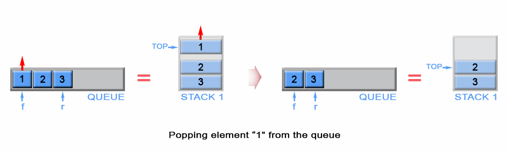
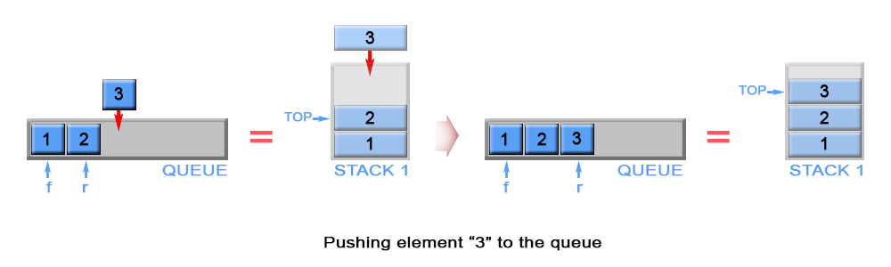

## Stack

 |S.No| Problem | Difficulty | Solved | Rethink?  | Comments/Algorithms/Tags  |
 |---|---|---|---|---|---|
  | 1 | | | | | |
  | 2| | | | | |
  | 3 | | | | | |
  | 4 | | | | | |
  | 5 | | | | | |
  | 6 | | | | | |
  | 7 | | | | | |
  | 8 | | | | | |
  | 9 | | | | | |
  | 10 | | | | | |
  | 11 | | | | | |
  | 12 | | | | | |
  | 13 | | | | | |
  | 14 | | | | | |
  | 15 | | | | | |

| Algorithm                                                                                                   | Push                                           | Pop                              |    |
|:------------------------------------------------------------------------------------------------------------|:-----------------------------------------------|:---------------------------------|:---|
| QueueUsing2Stacks - Approach #1 (Two Stacks)                                                                |       |  |    |
| QueueUsing2Stacks - Approach #2 (Two Stacks) Push - O(1) per operation, Pop - Amortized O(1) per operation. |  |  |    |

### Applications of stack
1. Function calls
2. Checking for balance of parenthesis
3. Reversing items
4. Infix to infix/postfix
5. Evaluation of postfix/prefix
6. Stock span problem and its variations
7. Undo and Redo operation (Forward/Backward in web-browsers)
