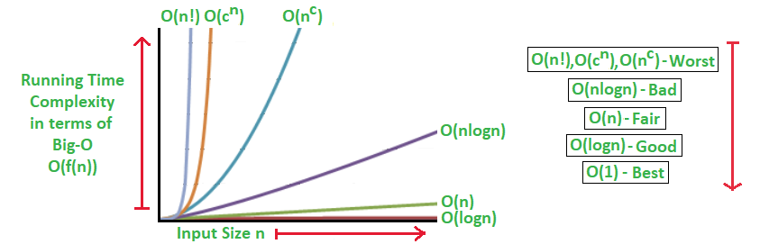

# Time complexity and Space Complexity

## [Introduction](https://practice.geeksforgeeks.org/tracks/PC-W1-I/?batchId=140) Section discusses this

>  TO-DO - Have to revisit the section and make notes on computing time complexity of recursive solutions

- Analysing Time Complexity
   - Introduction to Asymptotic Notation 
   - How to calculate Time Complexity 

     - Analysis of Recursion

    -  Analysing Time Complexity

  - Asymptotic Notation
